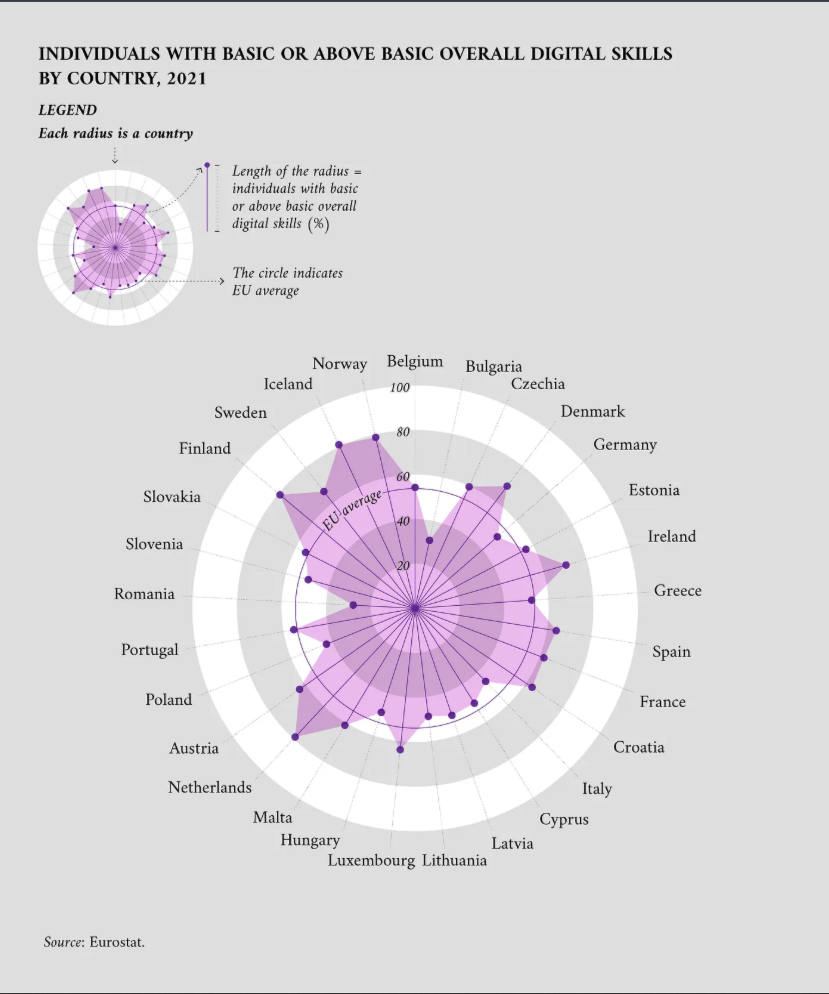

# We Are Not Prepared for AI

Artificial Intelligence (AI) has been for a long time a misunderstood domain close to science fiction. It is only recently that a handful of people developed and shook the world with machines able to not only replicate but outperform people in one of its key domains, thought to be the most enigmatic and humane of all that there might be: **creativity**.

Generative AI, as this model is called, has sent shockwaves around the world, infusing panic, enthusiasm, and apathy in the hearts of everyone coming into contact for the first time with this novel technology. But the question remains: *How should we react to these Machine Intelligent Model Actors (MIMA)?*

Finding an answer to this question is even more difficult if we consider that we must be skeptical about the opinions of its developers. I will try to divide this problem, expose it in simpler terms, and make analogies to have a better sky view of one of the most complex and important problems that will affect humankind from now on, as this question sheds both light and darkness on the nature of humans themselves, and shakes our present philosophical systems from the roots.

We must start by asking ourselves what a computer is. According to an OECD study from 2016, around 26% of the adult population does not know how to use a computer. The situation is a little better today, but not as bright as we would hope. The 2023 Report on the state of the Digital Decade created by the European Union provides an even clearer view into the level of digital literacy in these developed states.

These percentages fluctuate and the study refers to how many people know to work their way around a computer, but I think that the conclusion is evident: **Many people do not know how to use a computer proficiently.** Most people have no idea how a computer works from a physical point of view, meaning: *how does it transform electricity into these images and everything else?*

We have used them for so long, and yet most of us don’t know how they work, and even worse, how to use them so that we can protect ourselves from cybercrimes. If we want to limit the harmful use of AI, much more effort is needed to teach people cybersecurity and how to navigate the internet, especially vulnerable segments of the population.

What can we expect of AI? People are very efficient in using a tool, in understanding its outcome, but how that tool is made, and how it works, remains a mystery many times as the tool becomes more complex. The problem with AI has 2 sides: **both how it works and how it will be used.** The incredible growth and advancement brought by this futuristic wave of events are eclipsed by a fear that seemed long time as Sci-Fi, with people using AI for terrorist attacks, with robots becoming self-aware and trying to destroy humanity. But for those of us more pragmatic, how could AI be used for propaganda, identity theft, or even war? In the face of the storm, I think we should remain calm to reach the shore.

---

## What is a Computer?

So, let’s start from the beginning. A computer is an electronic device for storing and processing data, typically in binary form, according to instructions given to it in a variable program. It does that by using **bits**. When electricity runs through the computer, it needs a certain voltage to “activate” a bit, to which we attribute, as a convention, a value of either 1 or 0.

Combinations of these 1 and 0 give $2^n$ possible representations (where $n$ is the number of bits). In this way, we can use an enormous amount of these bits (billions, trillions, or more), to communicate with machines. It works somewhat as the Morse Code: 
1. First, you get a non-coherent unit (a bit or a signal).
2. Then you combine them to create atomic units (in Morse Code — the letters of the alphabet).
3. Then you use these atomic units to construct a language, which is a coherent system of symbols that represent real, tangible objects, abstract representations, or other symbols. In our case, we represent these symbols using electricity.

Energy is the very essence of existence. Without it, there would be no motion, and without motion, there would be no time. Electricity is a form of energy, and therefore, by transforming it into a language, we created the possibility to manipulate a building block of the universe using human terms, for human means.

But just like any other system, we might sometimes not fully understand something although we see and know its results, or we might know how to do something, but the result remains mysterious. We also have the drunk approach, where we try things at random hoping that something would make sense.

---

## What is AI?

The way that AI works today is somewhat like a set of scales: you put a certain object on its right, and AI adjusts its weights to balance the scale. In other words, **it delivers what you expect it to deliver.**

The current definition, here given by John McCarthy in a 2004 paper, is misleading in my opinion:

> *“It is the science and engineering of making intelligent machines especially intelligent computer programs. It is to understand human intelligence, but AI does not have to confine itself to biologically observable methods.”*

It is misleading, because of two primary reasons:

1. **It assumes that the term intelligence is self-explanatory.** It is not. People struggled to define intelligence since the dawn of humankind, but every definition fell short, and none has been generally accepted because we simply do not know for sure how our brain functions. Even though considerable effort has been made by neuroscientists in the last few decades, we still lack a good understanding of intelligence from a biological point of view. Thinking is rather a loose term when we say we make a decision. In a way, our brain is a biological computer.
2. **It leads people to think that AIs are more human than they are in reality.** It makes people think — and for sure Sci-Fi played a role here — that AI has some kind of personality or consciousness.

Saying that AI can “know” something is like saying that your parrot yells at your neighbor because it hates getting woken up by his motorbike. What we as humans “know” is defined by emotions and intuitions.

---

## Why Do We Fear AI?

AI does not have biological threats embedded inside it, because it has no biological basis. Once the possibility of General Artificial Intelligence appeared as a matter of time, we realized something as old as humanity itself: **We want God to be subdued to us.**

Any god that is more than a story, more than an idea that guides our society, is perceived as an existential threat and loses its divine aura. That is true in many of our religions. Once God comes down from a higher existential plane and intervenes in the affairs of humans it becomes somewhat of an apocalyptic force.

The idea of a god on earth has never been associated with a good event. It is a deep-rooted fear in us. The only instance when a good god walked the earth was when it took the form of a human to save humanity. Whenever a god approached Earth in its true form, Earth was changed entirely. We will never see any AI as close to a good god, because it was created by humans.

Suspicion of the works of other people has been essential to our preservation. It is impossible to know what is inside someone’s mind, therefore, there have to be customs and procedures to keep both entities safe from each other. Suspicion between different groups gave birth to geopolitics. AI is a triple case of suspicion: **because it was created by humans, it resembles humans, and yet, it is so different that we have no idea how it truly works.**

At the moment, AI is learning mechanically — information is memorized, tweaked, and compared again and again to achieve a target set by a human operator. At the point where a system can set its own goals, compare them against targets set by itself, and adapt to new goals set by itself, we talk about **Artificial General Intelligence (AGI)**.

It is our mission to control:
- The capabilities of AI
- The data it receives
- The people that can use it

---

## How Has AI Become Creative?

It didn’t. Our idea of creativity was wrong from the beginning. We lied to ourselves that we could create something new, but that is 99% false. Art is that 1% left out. Art is combining existing concepts to express existing ideas in a new way, for them to be better understood by someone else.

AI has deciphered the atomic units in Art from the cryptic works of thousands of artists in just a few years. In a way, AI is creative the way a student copying an artwork and changing some elements is creative. But this is only a barrier that will soon be passed. It is not AI that is limited; it is we who use art to reflect human concepts.

---

## What Can AI Influence?

There are 4 levels of AI involvement based on scope and target audience:

### 1. Low-Level
One person using AI for personal benefit (e.g., stock footage, workflow automation, travel itineraries, deepfakes). This is where individuals benefit directly.

### 2. Mid-Level
Small groups or organizations (e.g., small companies, schools, hospitals) using AI to enhance operations. Benefits multiple entities without changing the domain itself. Combined with low-level, this is often called **“Boring AI”** because most value is derived from practical applications.

### 3. High-Level
Large organizations (global companies, governments, large consortiums, hacker groups) using AI to alter the domain itself (e.g., changing business models, policy decisions, transportation, or cyberattacks).

### 4. Super-Level
Physical or infrastructure changes resulting from AI optimization (e.g., hardware GPUs designed specifically for AI, or automated security shutdown systems reacting to AI infiltration).

---

## AI and Cybersecurity

Electronic Warfare and cybercrime are here to stay. Preventing all crime is impossible, but governments around the world should rush to implement measures today while criminal organizations do not yet have access to custom supercomputer-level AI models.

### The Looming Threat
With data breaches becoming larger (such as the 2024 breach leaking 26 billion records from Tencent, X, LinkedIn, and Adobe), individuals are at unprecedented risk of scams. Phishing attacks using deepfakes, AI voice cloning, and automated text generators allow hackers to impersonate trusted contacts with ease.

### So, What Can We Do?
Most breaches stem from three core vulnerabilities:
1. Lack of cybersecurity personnel
2. Lack of digital skills and cybersecurity knowledge among employees
3. Known misconfigurations that could have been resolved

Institutions must invest in regular cybersecurity training and free digital literacy courses for vulnerable populations.

### AI Defense
Just as AI can be weaponized for phishing, AI defense tools (anomaly detection, automated cloud backups, endpoint protection) will play a critical role in shielding systems from attackers.

---

## Who Will Have AI?

Training a complex AI model is expensive and requires massive compute infrastructure (supercomputers reaching hundreds of petaflops). Only governments and major tech corporations will be able to train and maintain top-tier models.

While AI will outperform humans at specific data-driven tasks, saying it will trigger a universal wave of layoffs ignores how diverse the global economy is. People whose work relies entirely on abstract data manipulation will adapt, and new opportunities will emerge as AI continues to evolve.